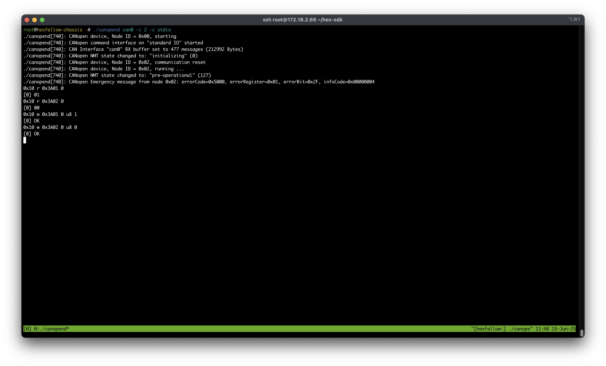

# hex-pcw-direct-can-control-demo
The demo code to use rust/python to control hex-pcw using SocketCan directly

This demo will only control one pcw. Make sure you set the object dictionary of pcw to the correct value(3A01 should be 1, 3A02 should be 0).

## Common Setup
1. Read the product docs on out docs site. (Important!)
2. Makesure your system can handle can fd. Set system with correct bitrate (Default is 1M, 2M) `ip link set can0 type can bitrate 1000000 dbitrate 2000000 fd on` and `ip link set can0 up` (Replace can0 with your can interface)
3. Make sure the OD settings are correct. (This only has to be done once) For this example, 0x3A01-00 should be 1, 0x3A02-00 should be 0. For meaning of these numbers, check our documentation website.

### Change default OD settings to your custom settings using CANOpenLinux
> ***If you don't plan to change default settings, you should skip this step.*** This step is only needed if you want to change the OD settings.
> 
> By default, the 0x3A01-00 is 1, 0x3A02-00 is 0. 

In case you don't have tools to read/write OD, you can use CANOpenLinux to do so.

1. Clone the repo using `git clone https://github.com/CANopenNode/CANopenLinux.git --recursive`
2. Build the project using `make`
3. Bring up can
4. Run the canopenlinux using `./canopend can0 -i 2 -c stdio` (Replace can0 with your can interface)
5. Type `0x10 r 0x3A01 0` to check the value of 0x3A01-00, it should be 1
6. Type `0x10 r 0x3A02 0` to check the value of 0x3A02-00, it should be 0
7. If `0x3A01-00` is not 1, type `0x10 w 0x3A01 0 u8 1` to set the value of 0x3A01-00 to 1
8. If `0x3A02-00` is not 0, type `0x10 w 0x3A02 0 u8 0` to set the value of 0x3A02-00 to 0

---

## Python
> This demo uses asyncio. If your python version is too old, it will not work.

1. Make sure everything in common setup is done.
2. Run `pip3 install -r requirements.txt` to install the required dependencies. Using venv is ok.
3. Change `bus = can.Bus(channel='can0', bustype='socketcan', fd=True)` in main.py to your can interface.
4. Run `python3 main.py` to start the script.
5. Watch it rotate

## Rust

1. Make sure everything in common setup is done.
2. Run `cargo run --release -- -c can0` (Replace can0 with your can interface)
3. Watch it rotate
